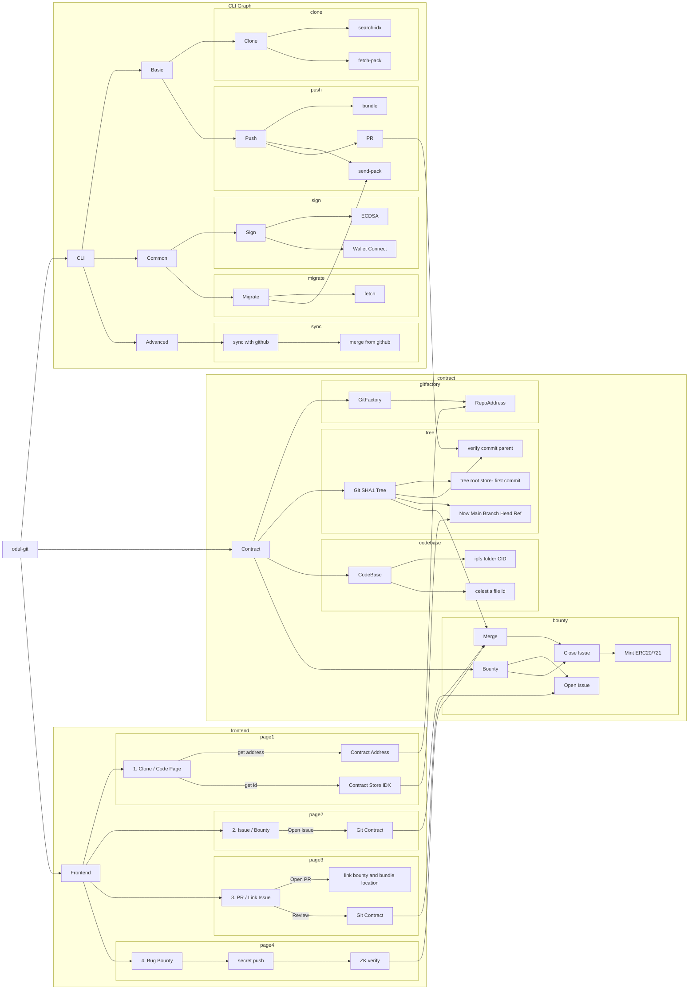

<div align="center">
<h1>ÖdülGit</h1>

<p> An on-chain bounty platform to bolster developer community</p>

</img>

[](./LICENSE) [](https://www.npmjs.com/package/odul) [](https://github.com/odulgit/odulgit/actions/workflows/ghpages.yml)
</div>

### Demo Page
- WebPage: [odulgit.net/odulgit/](https://odulgit.net/odulgit/)
- tweet: https://twitter.com/kidneyweakx/status/1726114026768540040
- Video: [https://youtu.be/](https://youtu.be/)
- Contract Address:
  - Sepolia Address: https://sepolia.etherscan.io/address/0xC359132E29bf040aA546b4de51B06D6e4B772628#code
  - Scroll Sepolia Address: https://sepolia.scrollscan.com/address/0xC359132E29bf040aA546b4de51B06D6e4B772628#code
  - Chiado Testnet Address: https://gnosis-chiado.blockscout.com/address/0xC359132E29bf040aA546b4de51B06D6e4B772628#code
  - Aribitrum Stylus Address: https://stylus-testnet-explorer.arbitrum.io/address/0xC359132E29bf040aA546b4de51B06D6e4B772628#code
  - Polygon ZKEVM Address: https://testnet-zkevm.polygonscan.com/address/0xC359132E29bf040aA546b4de51B06D6e4B772628#code

### Abstract
OdulGit is actually an on-chain dev-centric tool designed for developers. There’re 3 key elements of it.
First, bounty as the incentive for developer community. Anyone on GitHub could list the issue with reward.  
Second, as every issues is awarded, the real contributors could be engaged more precisely by the project owner. (of course, in that way, we believe the sybil attack could be mitigated.
Third, the pull request is verified and voted  by DAO, a group of code owners, to facilitate the pull request reviewing process and make it more objective

### Problem Statement
- Bounty as the incentive for developer community.
- Code owners/contributors as a DAO to verify pull request.
- Precise engagement with those who contribute to the community between Web2 and Web3.

### Solution
- Verify SHA1 commit on-chain, can avoid spam commits
- Use `IPFS and Filecoin` store git codebase
- Use `walletconnect` connect CLI tool and developer source version control platform


### Build & Installation

> OdulGit is a monorepo managed using turbo. You can find the source code for each package in the `apps` and `packages` directory.

- `apps/odul` is the CLI tool built from yargs.
- `apps/web` is the web frontend. It is built using [Next.js](https://nextjs.org/) and [ui.shadcn](https://ui.shadcn.com/).
- `packages/git-contract` solidity contract verify commit
  - core: DAO, Bounty, Git
  - Git: init, push, merge, verify commit
  - Bounty: give bounty and set issues
  - DAO: make contributors review codebase
- `packages/storage-helper` ipfs and filecoin environment. Provide filecoin deal contract and upload on lotus function.

1. Install all peer dependencies
```
pnpm install
```

2. Build All need
```
pnpm build
```

3. Use npm link to use CLI
```
cd apps/odul
npm link
```

### Technical Architechure

> FlowChart Overview


